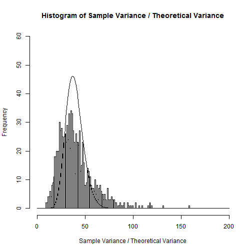

Statistical Inference Course Project Response 1
================================

**Principal Author**  
Dr. John R. Withrow Jr.  
Cherokee Nation Technologies  
Contractor for USDA-FS FHTET  
NRRC Building A Ste 331  
2150 Centre Avenue  
Fort Collins, CO 80526  
johnwithrow@fs.fed.us  


***

### Executive Summary
The Central Limit Theorem provides an adequate approximation for describing the distribution of possible means and variances of a population, even when the original population has a distribution of values that significantly depart from those of a Normal distribution.

***

### Analytical Context
#### Scientific Discussion
The exponential distribution, although having a wide array of applications in science and mathematics, possesses a shape that is highly non-Normal.  Although it possesses a peak at $x = 0$, it is highly skewed in that it is only defined for nonnegative inputs.  In contrast, the Central Limit Theorem in statistics (Ott 1993) states that any distribution of data that is created as the result of equally-weighted sums of variables will tend to be increasingly normal in shape as the number of sums increases.  The CLT further states that such will be true regardless of the fundamental distribution of the constituent variables.  
In this analysis the CLT is put to the test as we examine sums and variances of sets of 40 samples taken from the exponential distribution.

#### Software Environment
**Session Information**  

```r
sessionInfo()
```

```
## R version 3.2.1 (2015-06-18)
## Platform: x86_64-w64-mingw32/x64 (64-bit)
## Running under: Windows 7 x64 (build 7601) Service Pack 1
## 
## locale:
## [1] LC_COLLATE=English_United States.1252 
## [2] LC_CTYPE=English_United States.1252   
## [3] LC_MONETARY=English_United States.1252
## [4] LC_NUMERIC=C                          
## [5] LC_TIME=English_United States.1252    
## 
## attached base packages:
## [1] stats     graphics  grDevices utils     datasets  methods   base     
## 
## other attached packages:
## [1] stargazer_5.2 raster_2.3-40 sp_1.1-1     
## 
## loaded via a namespace (and not attached):
##  [1] Rcpp_0.11.6        knitr_1.13         magrittr_1.5      
##  [4] munsell_0.4.3      colorspace_1.2-6   lattice_0.20-33   
##  [7] R6_2.0.1           stringr_1.0.0      httr_1.1.0        
## [10] plyr_1.8.3         tools_3.2.1        parallel_3.2.1    
## [13] grid_3.2.1         gtable_0.2.0       htmltools_0.2.6   
## [16] yaml_2.1.13        digest_0.6.8       crayon_1.3.1      
## [19] formatR_1.4        ggplot2_2.1.0      bitops_1.0-6      
## [22] rsconnect_0.4.1.11 RCurl_1.95-4.8     testthat_1.0.2    
## [25] mime_0.3           evaluate_0.9       memoise_1.0.0     
## [28] rmarkdown_0.9.6    stringi_1.0-1      scales_0.4.0      
## [31] swirl_2.4.1        markdown_0.7.7
```
Random Number Seed: 19680828

```r
set.seed(19680828)
```

***

### Analytical Process
#### Data Acquisition
No external dataset is required for this analysis.  All analyses are performed on simulated data.  
Simulations make use of the 'rexp' command in R, which generates random numbers distributed according to an exponential distribution:

$$
p(x) = \left\{ \begin{array}{rl} 0 & x<0 \\ \lambda e^{-\lambda x} & x \geq 0 \end{array} \right.
$$

where $\lambda$ is a rate parameter.  An example of this distribution is shown below with a lambda parameter of 1:

```r
hist(rexp(100000,1),xlab="x",main="The Exponential Distribution, Lambda = 1")
```


From Casella and Berger (1990) we are informed that the mean and variance of this distribution are:

$$
\mu = E\{p(x)\} = \int_0^{\infty} \lambda x e^{-\lambda x} dx = \frac{1}{\lambda}
\hspace{35pt}
\sigma^2 = \sigma^2\{p(x)\} = \int_0^{\infty} \lambda x^2 e^{-\lambda x} dx - E\{p(x)\}^2 = \frac{1}{\lambda^2}
$$

In the following analysis we are working specifically with an exponential distribution with a lambda value of 0.2.  

#### Exploratory data analysis
We begin with our particular simulated version of this distribution:

```r
x <- rexp(1000000,0.2)
hist(x,xlab="x",main="Our Specific Exponential Distribution, Lambda = 0.2")
```


Given our value of $\lambda$ we can calculate theoretical values of the mean and variance:

$$
E\{p(x)\} = \frac{1}{\lambda}=\frac{1}{0.2}=5
\hspace{35pt}
\sigma^2\{p(x)\} = \frac{1}{\lambda^2}=5^2=25
$$

which we can also confirm computationally:


```r
z <- c(mean(x),var(x))
names(z) <- c("Mean","Variance")
z
```

```
##      Mean  Variance 
##  4.997438 24.990883
```

In both cases we are within 0.1% of the theoretical value:


```r
z <- c((5-mean(x))/5*100,(25-var(x))/25*100)
names(z) <- c("Mean","Variance")
z
```

```
##       Mean   Variance 
## 0.05124156 0.03646802
```

#### Statistical prediction/modeling

According to the Central Limit Theorem, estimates of a population mean should be approximately normally distributed:

$$
\overline{x} \sim N(\mu,\frac{\sigma^2}{n})
$$

In our case we are directed to work with samples of size 40, so our estimates should be distributed accordingly:

$$
\overline{x_{40}} \sim N(5,\frac{25}{40}) = N(5,0.625)
$$

This is simulated using 1000 averages of 40 samples:


```r
xx <- replicate(1000,mean(sample(x,40)))
hist(xx,xlab="x",main="Distribution of Samples of 40")
xxx <- numeric(0)
for (i in 2000:8000) {xxx <- c(xxx,dnorm(i/1000,mean=5,sd=sqrt(0.625)))}
lines(seq(2,8,.001),xxx*1000/2)
```


where the above histogram is overlayed with a corresponding Normal distribution suggested by the Central Limit Theorem.  Strong agreement is observed.  An actual mean and variance is calculated as follows:


```r
z <- c(mean(xx),var(xx))
names(z) <- c("Mean","Variance")
z
```

```
##      Mean  Variance 
## 4.9772797 0.6037561
```

Lastly, a perhaps even more intense test of the CLT can come from a comparison of the sample variances with theory.  If $Z_1, \dots, Z_k$ are independent, standard normal random variables:

$$
Z \sim N(0,1)
$$

then the variance of a sample of size $k$ should be distributed according to the chi-squared distribution. This is demonstrated via the following:

$$
\sigma^2\{Z\} = E\{ Z^2 \}  - (E\{Z\})^2 = E\{Z^2\} = \frac{1}{k}\sum_{i=1}^{k}Z_i^2
$$
$$
(k-1)\sigma^2\{Z\} = \sum_{i=1}^{k}Z_i^2 \sim \chi^2_{k-1}
$$

where we have subracted off one degree of freedom $(k-1)$ for the calculation of the mean and have utilized properties of random variables defined by Neter et al. (1996). Then for our purposes:

$$
\frac{(x_{40}-5)}{\sqrt{0.625}} \sim N(0,1)
$$

and so:

$$
(k-1)\sigma^2\{\frac{(x_{40}-5)}{\sqrt{0.625}}\} = \frac{(k-1)}{0.625}\sigma^2\{x_{40}\} \sim \chi^2(k-1)
$$


```r
xx <- replicate(1000,var(sample(x,40)))
hist(xx/.625,ylim=c(0,60),breaks=seq(0,200),xlab="Sample Variance / Theoretical Variance",main="Histogram of Sample Variance / Theoretical Variance")
lines(seq(0,200),dchisq(seq(0,200),df=39)*1000)
```



### Conclusion
The Central Limit Theorem provides an adequate approximation for describing the distribution of possible means and variances of a population, even when the original population has a distribution of values that significantly depart from those of a Normal distribution.

***

### References
Casella G, Berger RL 1990. Statistical inference, Wadsworth and Brooks, 650pp.  
Neter J, Kutner MH, Nachtsheim CJ, Wasserman W 1996. Applied linear statistical models, fourth edition, WCB McGraw-Hill, 1408pp.
Ott RL 1993. An introduction to statistical methods and data analysis, Fourth Edition, Duxbury Press, 1051pp.

***

#### End of Analysis
